# Delivery Order & Checkpoints Plan

This document outlines the delivery order for the fitness app, with clear checkpoints where you can verify alignment before proceeding.

**Note**: The mobile/Next.js app serves as the primary **data ingestion interface** - a fast, mobile-optimized way to capture daily check-ins, workouts, and related data. More complex analysis, visualization, and management can happen on desktop or other tools.

## Critical Path & Dependency Flow

```mermaid
graph TD
    PrePhase0[Pre-Phase 0: Planning & Setup]
    PrePhase0 --> Wireframes[Wireframe Planning]
    PrePhase0 --> CursorRules[Cursor Rules Setup]
    
    Wireframes --> Phase0[Phase 0: Infrastructure Setup]
    CursorRules --> Phase0
    
    Phase0 --> Phase1[Phase 1: Foundation]
    
    Phase1 --> DB[Database Schema]
    DB --> Auth[Authentication]
    Auth --> ExerciseAPI[Exercise Catalog API]
    ExerciseAPI --> CheckinBackend[Check-In Backend API]
    CheckinBackend --> CheckinUI[Check-In UI]
    CheckinUI --> RecEngine[Recommendation Engine]
    
    RecEngine --> Phase2[Phase 2: Workout Logging]
    
    Phase2 --> PlanUI[Today's Plan UI]
    PlanUI --> WorkoutAPI[Workout API]
    WorkoutAPI --> WorkoutUI[Active Workout UI]
    WorkoutUI --> PWA[PWA Setup]
    
    PWA --> Phase3[Phase 3: Analytics]
    
    Phase3 --> StimulusCalc[Muscle Stimulus Calculation]
    StimulusCalc --> NeglectDetect[Neglect Detection]
    NeglectDetect --> MuscleViz[Muscle Visualization]
    MuscleViz --> AnalyticsUI[Analytics Dashboard]
    
    AnalyticsUI --> Phase4[Phase 4: Nutrition]
    
    Phase4 --> FoodDB[Food Database Integration]
    FoodDB --> VoiceInput[Voice Input]
    VoiceInput --> NutritionUI[Nutrition Logging UI]
    NutritionUI --> NutritionSummary[Nutrition Summaries]
    
    NutritionSummary --> Phase5[Phase 5: Medications]
    
    Phase5 --> MedAPI[Medication API]
    MedAPI --> MedUI[Medication UI]
    MedUI --> Adherence[Adherence Tracking]
    
    Adherence --> Phase6[Phase 6: Health Profile]
    
    Phase6 --> BloodWork[Blood Work Entry]
    BloodWork --> MedHistory[Medical History]
    MedHistory --> Export[Data Export]
```

## Delivery Order with Checkpoints

### Pre-Phase 0: Planning & Wireframes (Before Day 1)

**Purpose**: Establish design direction, UI patterns, and development guidelines before coding begins

#### Wireframe Planning
**Deliverables**:
- Review and document all wireframes (HTML provided by user)
- Map wireframes to app routes/pages
- Identify reusable UI components
- Document interaction patterns
- Define mobile-first breakpoints
- Create component library plan

**Key Wireframes to Plan**:
- Morning Check-In screen
- Today's Plan screen
- Active Workout screen
- Workout History screen
- Analytics/Muscle Visualization screen
- Settings/Configuration screens

**CHECKPOINT Pre-0.1**: Wireframe Planning Complete
- [x] All wireframes reviewed and documented
- [x] Component breakdown identified
- [x] Interaction patterns defined
- [x] Mobile-first approach validated
- [x] Wireframes align with project goals

#### Cursor Rules Setup (AnswerSome)
**Deliverables**:
- Review AnswerSome cursor rules provided by user
- Integrate rules into architecture planning documents
- Validate rules align with project requirements
- Document how rules inform technical decisions
- Update delivery plan to reflect rule integration

**AnswerSome Rules Integration**:
- Rules will be reviewed for compatibility with tech stack
- Rules will inform architecture planning decisions
- Rules will guide component patterns and code organization
- Rules will be referenced during implementation checkpoints
- Rules will influence API design and database patterns

**CHECKPOINT Pre-0.2**: Cursor Rules Integrated
- [x] AnswerSome cursor rules received and reviewed
- [x] Rules integrated into architecture planning
- [x] Rules align with tech stack (Next.js, Prisma, TypeScript)
- [x] Integration points documented
- [x] Ready to begin implementation with rules in place

---

### Phase 0: Project Setup (Days 1-2)
**Status**: Foundation that everything else depends on

**Day 1 Deliverables**:
- Next.js project initialized and running
- TypeScript configured
- Tailwind CSS working
- Project folder structure in place (aligned with wireframes)
- Cursor rules applied

**Day 2 Deliverables**:
- Docker Compose with PostgreSQL running
- Prisma schema defined
- Database migrations working
- Seed data loaded (exercises, muscles, mappings)

**CHECKPOINT 0.1**: After Day 2
- [x] Can run `npm run dev` and see Next.js app
- [x] Can connect to PostgreSQL database
- [x] Prisma schema includes all core tables
- [x] Seed script runs successfully
- [x] Project structure matches wireframe component plan

---

### Phase 1: Foundation & Core Data (Days 3-7)
**Status**: ✅ COMPLETE

#### Day 3: Authentication
**Dependencies**: Database schema must be complete
**Deliverables**:
- Session-based auth working
- User setup flow
- Protected API routes

**CHECKPOINT 1.1**: After Day 3
- [x] Can create user account
- [x] Can "log in" and get session
- [x] API routes require authentication

#### Day 4: Exercise & Muscle Management
**Dependencies**: Authentication must work
**Deliverables**:
- Exercise catalog API endpoints
- Exercise management UI
- Exercise-muscle mappings functional

**CHECKPOINT 1.2**: After Day 4
- [x] Can query exercises via API
- [x] Can create custom exercises
- [x] Exercise-muscle mappings are correct

#### Day 5: Check-In Backend
**Dependencies**: Exercise data available
**Deliverables**:
- Check-in API routes (CRUD)
- Validation schemas
- Check-in service layer

**CHECKPOINT 1.3**: After Day 5
- [x] Can create check-in via API
- [x] Can retrieve today's check-in
- [x] Validation rejects invalid data

#### Day 6: Check-In UI
**Dependencies**: Check-in backend API complete, wireframes reviewed
**Deliverables**:
- Mobile-optimized check-in form (matching wireframe)
- Interactive soreness body map (SVG)
- Form submission and redirect flow

**CHECKPOINT 1.4**: After Day 6
- [x] Check-in form matches wireframe design
- [x] Check-in form is usable on mobile
- [x] Soreness map is interactive
- [x] Submitting check-in redirects to plan page

#### Day 7: Recommendation Engine
**Dependencies**: Check-in data available
**Deliverables**:
- Basic split logic (Push/Pull/Legs)
- Recovery-aware recommendations
- Recommendation API endpoint

**CHECKPOINT 1.5**: After Day 7
- [x] Recommendation API returns workout plan
- [x] Split rotation works correctly
- [x] Recommendations account for soreness/energy

---

### Phase 2: Workout Logging & Daily Plan (Days 8-14)
**Status**: ⏳ IN PROGRESS

#### Day 8: Today's Plan UI
**Dependencies**: Recommendation engine must work, wireframes reviewed
**Deliverables**:
- Plan display page (matching wireframe)
- Plan modification options
- Plan persistence

**CHECKPOINT 2.1**: After Day 8
- [x] Plan page matches wireframe design
- [x] Plan page shows recommended workout
- [x] Can modify intensity/exercises
- [x] Plan persists for the day

#### Day 9: Workout API
**Dependencies**: Plan UI can create workouts
**Deliverables**:
- Workout CRUD API
- Workout set management API
- Validation and service layer

**CHECKPOINT 2.2**: After Day 9
- [ ] Can create workout via API
- [ ] Can add/update/delete sets
- [ ] Data structure supports analytics

#### Day 10: Active Workout UI
**Dependencies**: Workout API complete, wireframes reviewed
**Deliverables**:
- Workout page with exercise list (matching wireframe)
- Fast set logging interface
- Rest timer
- Progress tracking

**CHECKPOINT 2.3**: After Day 10
- [ ] Workout UI matches wireframe design
- [ ] Can log sets quickly during workout
- [ ] Rest timer works
- [ ] Workout flow is smooth and fast

#### Day 11: Workout History
**Dependencies**: Workouts are being logged
**Deliverables**:
- Workout history list
- Workout detail page
- Workout editing capability

**CHECKPOINT 2.4**: After Day 11
- [ ] Can view past workouts
- [ ] Can see workout details
- [ ] Can edit workout after completion

#### Day 12: PT Exercise Logging
**Dependencies**: Workout system working
**Deliverables**:
- PT exercise API
- PT logging UI
- PT integration into plan

**CHECKPOINT 2.5**: After Day 12
- [ ] PT exercises appear in plan
- [ ] Can log PT exercise completion
- [ ] PT data tracked separately

#### Day 13: PWA Setup
**Dependencies**: Core app functionality working
**Deliverables**:
- Service worker configured
- Offline storage with IndexedDB
- PWA manifest
- Offline workout logging

**CHECKPOINT 2.6**: After Day 13
- [ ] App installable on iPhone
- [ ] Can log workout offline
- [ ] Data syncs when back online

**CHECKPOINT 2.6**: After Day 13
- [ ] App installable on iPhone
- [ ] Can log workout offline
- [ ] Data syncs when back online

---

### Phase 3: Analytics & Visualization (Days 14-20)

#### Day 14: Muscle Stimulus Calculation
**Dependencies**: Workout data available
**Deliverables**:
- Stimulus calculation engine
- Stimulus API endpoint
- Optimized queries

**CHECKPOINT 3.1**: After Day 14
- [ ] Muscle stimulus scores calculated correctly
- [ ] API returns accurate data
- [ ] Performance is acceptable

#### Day 15: Neglect Detection
**Dependencies**: Stimulus calculation working
**Deliverables**:
- Training frequency calculation
- Neglect detection logic
- Integration with recommendations

**CHECKPOINT 3.2**: After Day 15
- [ ] Can identify neglected muscles
- [ ] Recommendations prioritize neglected muscles
- [ ] Frequency tracking accurate

#### Day 16: Volume & Intensity Trends
**Dependencies**: Analytics engine running
**Deliverables**:
- Volume trend calculations
- Intensity trend calculations
- Trends API with chart data

**CHECKPOINT 3.3**: After Day 16
- [ ] Trends calculated correctly
- [ ] API returns chart-ready data
- [ ] Historical data accessible

#### Day 17: Muscle Visualization
**Dependencies**: Analytics data available, wireframes reviewed
**Deliverables**:
- SVG human body component (matching wireframe design)
- Color intensity mapping
- Multiple view modes

**CHECKPOINT 3.4**: After Day 17
- [ ] Muscle visualization matches wireframe
- [ ] Muscle visualization displays correctly
- [ ] Colors represent stimulus accurately
- [ ] Multiple views work (today, 7 days, etc.)

#### Day 18: Analytics Dashboard
**Dependencies**: Visualization component ready, wireframes reviewed
**Deliverables**:
- Analytics page (matching wireframe)
- Key metrics display
- Chart visualizations

**CHECKPOINT 3.5**: After Day 18
- [ ] Analytics page matches wireframe design
- [ ] Analytics page displays all metrics
- [ ] Charts render correctly
- [ ] Data updates in real-time

#### Day 19: Recommendation Explanations
**Dependencies**: Analytics complete
**Deliverables**:
- Recommendation reasoning display
- Explanation generation
- User feedback loop

**CHECKPOINT 3.6**: After Day 19
- [ ] Recommendations include explanations
- [ ] Users understand why workout was suggested
- [ ] Feedback influences future recommendations

#### Day 20: Weekly Summaries
**Dependencies**: All analytics working
**Deliverables**:
- Weekly summary generation
- Summary display page
- Email/delivery mechanism (optional)

**CHECKPOINT 3.7**: After Day 20
- [ ] Weekly summaries generated correctly
- [ ] Summary page displays key insights
- [ ] Data aggregation accurate

---

### Phase 4: Nutrition Tracking (Days 21-27)

#### Day 21: Nutrition Database Integration
**Dependencies**: Core app functional
**Deliverables**:
- USDA FoodData Central API integration
- Food search API endpoint
- Custom food entry support
- Food database service layer

**CHECKPOINT 4.1**: After Day 21
- [ ] Can search food database via API
- [ ] Can create custom food entries
- [ ] Nutrition data retrieved correctly

#### Day 22: Nutrition API & Backend
**Dependencies**: Food database available
**Deliverables**:
- Nutrition entry API routes (CRUD)
- Nutrition goals API
- Nutrition summary calculations
- Validation schemas (Zod)

**CHECKPOINT 4.2**: After Day 22
- [ ] Can create nutrition entries via API
- [ ] Can set nutrition goals
- [ ] Daily summaries calculated correctly

#### Day 23: Voice Input Integration
**Dependencies**: Nutrition API ready
**Deliverables**:
- Web Speech API integration
- Voice input component
- Speech-to-text conversion
- Error handling for unsupported browsers

**CHECKPOINT 4.3**: After Day 23
- [ ] Voice input works on supported browsers
- [ ] Fallback for unsupported browsers
- [ ] Text transcription is functional

#### Day 24: Meal Logging UI
**Dependencies**: Voice input working, wireframes reviewed
**Deliverables**:
- Meal logging form (matching wireframe)
- Voice input button integration
- Food search/selection interface
- Macro display and editing

**CHECKPOINT 4.4**: After Day 24
- [ ] Meal logging UI matches wireframe
- [ ] Can log meals via voice or manual entry
- [ ] Food search works smoothly
- [ ] Macros are displayed and editable

#### Day 25: Natural Language Parsing (Basic)
**Dependencies**: Voice input working
**Deliverables**:
- Simple parsing rules for meal descriptions
- Quantity extraction (numbers, units)
- Food item identification
- Edit/correction interface

**CHECKPOINT 4.5**: After Day 25
- [ ] Basic parsing extracts quantities and foods
- [ ] Users can correct parsing errors
- [ ] Parsing improves entry speed

#### Day 26: Nutrition Summary & Goals UI
**Dependencies**: Nutrition tracking working
**Deliverables**:
- Daily nutrition summary page
- Macro progress visualization
- Goal setting interface
- Weekly nutrition trends

**CHECKPOINT 4.6**: After Day 26
- [ ] Daily summaries display correctly
- [ ] Macro progress is visible
- [ ] Goals can be set and updated
- [ ] Trends show over time

#### Day 27: Nutrition Integration & Polish
**Dependencies**: All nutrition features working
**Deliverables**:
- Integration into daily check-in flow
- Quick nutrition view in daily dashboard
- Meal templates (save common meals)
- Nutrition recommendations based on workouts

**CHECKPOINT 4.7**: After Day 27
- [ ] Nutrition integrated into daily flow
- [ ] Quick access to nutrition data
- [ ] Meal templates save time
- [ ] Recommendations consider nutrition

---

### Phase 5: Medications & Supplements (Days 28-33)

#### Day 28: Medication/Supplement API
**Dependencies**: Core app functional
**Deliverables**:
- Medication CRUD API routes
- Supplement CRUD API routes
- Logging API routes
- Validation schemas

**CHECKPOINT 5.1**: After Day 28
- [ ] Can create medications/supplements via API
- [ ] Can log when taken
- [ ] Can retrieve history
- [ ] Validation works correctly

#### Day 29: Medication/Supplement Management UI
**Dependencies**: API ready, wireframes reviewed
**Deliverables**:
- Medication/supplement list page
- Add/edit forms
- Dosage and frequency management
- Active vs. inactive tracking

**CHECKPOINT 5.2**: After Day 29
- [ ] Can manage medications/supplements
- [ ] Forms are easy to complete
- [ ] Active/inactive status works
- [ ] UI matches wireframe design

#### Day 30: Quick Logging Interface
**Dependencies**: Management UI working
**Deliverables**:
- Quick "Take Now" buttons
- Today's medication/supplement view
- Logging history list
- Edit/delete log entries

**CHECKPOINT 5.3**: After Day 30
- [ ] Quick log buttons work smoothly
- [ ] Today's view shows what to take
- [ ] History is accessible
- [ ] Logging is fast and easy

#### Day 31: Adherence Tracking
**Dependencies**: Logging working
**Deliverables**:
- Adherence calculations
- Adherence API endpoint
- Simple adherence visualization
- Weekly/monthly adherence summaries

**CHECKPOINT 5.4**: After Day 31
- [ ] Adherence calculated correctly
- [ ] Visualizations display properly
- [ ] Summaries are useful

#### Day 32: Integration & Daily View
**Dependencies**: All medication features working
**Deliverables**:
- Integration into daily check-in
- Quick view in daily dashboard
- Medication/supplement summary in check-in
- Optional reminders (future enhancement)

**CHECKPOINT 5.5**: After Day 32
- [ ] Medications integrated into daily flow
- [ ] Quick access available
- [ ] Summary displays in check-in

#### Day 33: Medication/Supplement Polish
**Dependencies**: Core features complete
**Deliverables**:
- UI refinements
- Error handling improvements
- Performance optimization
- Documentation

**CHECKPOINT 5.6**: After Day 33
- [ ] All features polished
- [ ] Error handling robust
- [ ] Performance acceptable
- [ ] Ready for use

---

### Phase 6: Health Profile (Days 34-40)

#### Day 34: Blood Work API
**Dependencies**: Core app functional
**Deliverables**:
- Blood work result CRUD API
- Trends calculation API
- Validation schemas
- Reference range handling

**CHECKPOINT 6.1**: After Day 34
- [ ] Can create blood work entries via API
- [ ] Can retrieve results
- [ ] Trends calculated correctly
- [ ] Reference ranges stored

#### Day 35: Blood Work Entry UI
**Dependencies**: API ready, wireframes reviewed
**Deliverables**:
- Blood work entry form
- Test type selection
- Value and unit input
- Reference range display

**CHECKPOINT 6.2**: After Day 35
- [ ] Entry form works smoothly
- [ ] Test types are easy to select
- [ ] Values entered correctly
- [ ] UI matches wireframe

#### Day 36: Blood Work Trends & Visualization
**Dependencies**: Entry UI working
**Deliverables**:
- Trend charts for blood work values
- Test type filtering
- Date range selection
- Chart visualization component

**CHECKPOINT 6.3**: After Day 36
- [ ] Trends display correctly
- [ ] Filtering works
- [ ] Charts are readable
- [ ] Performance is acceptable

#### Day 37: Medical History API
**Dependencies**: Core app functional
**Deliverables**:
- Medical history CRUD API
- Category management
- Search/filter API
- Validation schemas

**CHECKPOINT 6.4**: After Day 37
- [ ] Can create medical history entries
- [ ] Categories work correctly
- [ ] Search/filter functional
- [ ] API validated properly

#### Day 38: Medical History Management UI
**Dependencies**: API ready, wireframes reviewed
**Deliverables**:
- Medical history list page
- Category organization
- Add/edit forms
- Entry details view

**CHECKPOINT 6.5**: After Day 38
- [ ] History list displays correctly
- [ ] Categories organize well
- [ ] Forms are easy to use
- [ ] UI matches wireframe

#### Day 39: Data Export & Sharing
**Dependencies**: Health profile complete
**Deliverables**:
- Data export API (JSON, CSV)
- Export UI for health data
- Print-friendly views
- Data format for healthcare providers

**CHECKPOINT 6.6**: After Day 39
- [ ] Export works correctly
- [ ] Formats are usable
- [ ] Print views look good
- [ ] Data is complete

#### Day 40: Health Profile Integration & Polish
**Dependencies**: All health features working
**Deliverables**:
- Integration into app navigation
- Quick access to health data
- Summary views
- Final polish and testing

**CHECKPOINT 6.7**: After Day 40
- [ ] Health profile integrated
- [ ] Quick access available
- [ ] All features polished
- [ ] Ready for use

---

## Key Verification Points

### After Pre-Phase 0
- Wireframes provide clear direction
- Cursor rules support efficient development
- Design patterns established

### After Phase 0
Verify infrastructure is solid before building features

### After Phase 1
Verify core data flow: Check-in → Recommendation works end-to-end

### After Phase 2
Verify daily loop: Check-in → Plan → Workout → Log complete cycle
**Data ingestion working smoothly on mobile**

### After Phase 3
Verify insights: Analytics provide valuable feedback on training balance

### After Phase 4
Verify nutrition tracking: Fast meal logging, accurate macro tracking, voice input working

### After Phase 5
Verify medication tracking: Quick logging, adherence tracking, integrated into daily flow

### After Phase 6
Verify health profile: Data entry easy, trends visible, export functional

---

## Dependencies Summary

**Must Complete Before Starting Phase 0**:
- Wireframe planning and documentation
- Cursor rules setup

**Must Complete Before Starting Phase 1**:
- Database schema
- Authentication

**Must Complete Before Starting Phase 2**:
- Check-in flow (backend + UI)
- Recommendation engine
- Exercise catalog

**Must Complete Before Starting Phase 3**:
- Workout logging working
- Data being collected consistently (ingestion working)
- PWA functional

**Must Complete Before Starting Phase 4**:
- Core fitness features stable
- Database schema includes nutrition tables
- Food database API integrated

**Must Complete Before Starting Phase 5**:
- Nutrition tracking working
- Medication/supplement tables in database
- Basic medication logging functional

**Must Complete Before Starting Phase 6**:
- Medications/supplements working
- Health profile tables in database
- Basic health data entry functional

---

## "Vibe Coding" Alignment Notes

Each checkpoint allows you to:
- ✅ Verify features work as intended
- ✅ Test the user experience flow
- ✅ Ensure data structure supports next phase
- ✅ Make adjustments before building on top
- ✅ Verify UI matches wireframe designs
- ✅ Confirm mobile data ingestion is fast and reliable

You can pause at any checkpoint to refine, test, or adjust direction before proceeding to the next phase.

---

## Wireframes & UI Design

See `wireframes-plan.md` for detailed wireframe documentation and component breakdown.

*Wireframes provided as HTML will be integrated into the implementation plan*

